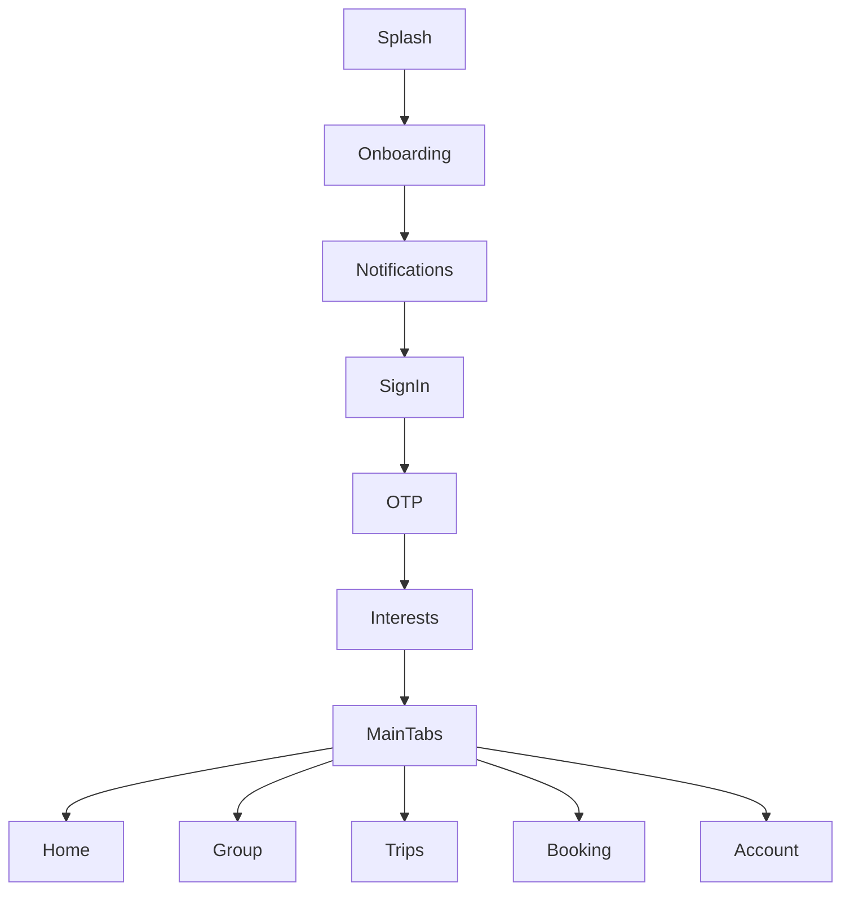

# WApp (Worldener) — App Summary

**WApp** is a React Native travel app (branded **Worldener** in onboarding copy) for discovering activities, planning trips, booking experiences (via **Musement**), coordinating with groups, and paying with **Stripe**. The backend is `https://api.worldener.com/api/v1/user`.

---

## Tech Stack

| Layer | Choices |
|--------|---------|
| Framework | React Native 0.81, React 19 |
| Navigation | React Navigation 7 (native stack + custom bottom tabs) |
| State | Redux Toolkit (`auth`, `cityTrip`, `chat`, `onlineStatus`, `payment`) |
| API | Axios client with auth interceptors |
| Payments | `@stripe/stripe-react-native` + backend payment intents |
| Auth extras | Google Sign-In, Apple Sign-In, phone OTP |
| Push | Firebase Cloud Messaging |
| Chat | Socket.IO + `react-native-gifted-chat` |
| Other | Lottie, calendars, contacts, image picker, blurhash images |

---

## App Flow (High Level)

- **Unauthenticated:** `AuthNavigator` (splash → onboarding → notifications → sign-in/sign-up → OTP → interests).
- **Authenticated:** `MainNavigator` with a **5-tab** shell (Home, Group, Trips, Booking, Account) and many stack screens on top.
- Session is restored from AsyncStorage (`USER_DATA`); presence is synced via `update-online-status` when the app foregrounds/backgrounds.

---

## Authentication & Onboarding

| Feature | Details |
|---------|---------|
| Phone login | Country code + mobile → OTP verification |
| Sign up | Registration flow with OTP |
| Social login | Google and Apple via `/socialLoginAndSignUp` |
| FCM | Device token sent with login for push |
| Onboarding | 3 slides: travel booking, group planning, AI recommendations |
| Notification prompt | Dedicated screen to enable notifications |
| Interests | Category selection from API; required for personalization |
| Legal | Privacy policy & terms via CMS (`getCms`) |
| Persistence | User + token stored locally; auto-login on relaunch |

---

## Main Tabs & Core Features

### 1. Home — Discovery

- Personalized greeting and **global search** (cities + events).
- **“Where to next?”** — horizontal city cards → city detail.
- **Browse by category** — category grid → filtered events.
- **“For You”** — personalized activity recommendations (`getEventsForYou`).
- Tap activity → **Activity Details**.

### 2. Trips — Personal Itineraries

- List trips with pull-to-refresh and **delete**.
- **Create trip** — pick city (search), date range (calendar), invite buddies from **contacts**.
- **Trip details** — itinerary, activities, buddies, edit trip, calendar view, per-trip checkout, link to cart.
- **Add to trip** — attach activities; invite members via `sendInvitation`.
- **Edit trip** — update dates/metadata.

### 3. Group — Collaborative Travel

- Lists travel **groups** tied to trips/cities (dates, member count, status).
- **Group chat** entry from list.
- **Group details** with tabs:
  - **Members** — roster, remove users, contact invites
  - **Compare** — compare interests/preferences with another member
  - **Wishlisted** — group wishlist for activities in a city
  - **Settings** — group management
- **Share activities** to groups from activity detail.
- **Block / report** users from chat.

### 4. Booking — Orders & History

- Tabs: **All**, **Upcoming**, **Past**, **Cancelled** (`getOrders` with status filters).
- Grouped by trip/city; drill-down to **booking details**.
- **Cancel** items (refund policy, date rules).
- **Vouchers** — download/view booking vouchers.
- Integration with **Musement** order data in API responses.

### 5. Account — Profile & Settings

- Profile photo, name, edit profile (multipart upload).
- **Saved cards / payment** screen.
- **Upcoming bookings** shortcut.
- **Notification settings** & notification inbox.
- **Update interests**.
- Terms, privacy policy.
- **Sign out** (clears storage + Redux).
- Placeholders: transaction history, FAQs, delete account (UI only / TODO).

---

## Discovery & Activities (Stack Screens)

| Screen / Flow | Function |
|---------------|----------|
| **Search city** | Search cities/events; can start create-trip or open city/activity |
| **City detail** | Popular events, per-city “For You”, categories, trip selector, **Surprises** (swipe deck) |
| **Browse by category** | Events filtered by category name |
| **Activity details** | Full event info, like/unlike, pickup points, languages, add to trip, share to groups |
| **Check availability** | Dates, times, ticket quantities, pricing → add to trip or update cart |
| **Surprises** | Tinder-style swipe on city activities (like/dislike, paginated `getCityActivities`) |

Activities are sourced from the backend (Musement-shaped payloads in bookings/cart).

---

## Cart & Checkout

1. **Cart** — multi-trip cart list, remove items, checkout → `cart-checkout`.
2. **Cart customer info** — participant schema, customer fields, `create-order`.
3. **Payment** — select Stripe card, `create-stripe-payment-intent`, pay.
4. **Payment success** — confirmation after payment.
5. **Payment methods / Add card** — manage saved cards (`get-stripe-card-list`, `add-card`, SetupIntent flow).
6. **Save card** — legacy route that redirects to Add Card.

Also: single-trip **checkout** from trip details (`checkout` endpoint).

---

## Chat & AI

| Feature | Details |
|---------|---------|
| **Group chat** | Real-time Socket.IO; emoji reactions; Gifted Chat UI; fetch history via API |
| **AI chat** | Trip/group-scoped chatbot (`/chatbot`); returns text + activity recommendations |
| **AI history** | List past conversations; resume threads (`chatbot/history-list`, `chatbot/history`) |
| **Entry points** | From group chat header, city “magic” FAB → Surprises (not AI directly), ViewAiChat list |

AI messages can surface bookable activities with images and prices.

---

## Notifications

- **Firebase** initialized at app launch (permission + iOS remote registration).
- **Notification screen** — tabs for notifications (partially static test data) and **group invitations** (accept/reject via API).
- **Notification settings** — user preferences screen.

---

## Payments (Stripe)

- `StripeAppBridge` wraps the app with Stripe publishable key.
- Redux `payment` slice holds checkout context and card list.
- `usePayments` hook: list cards, select card, add card (SetupIntent).
- Dev/mock paths documented in `PRODUCTION_READINESS_PROMPT.md` (local stripe-dev-server, mock cards — production cleanup still pending).

---

## Redux & Cross-Cutting Behavior

| Slice | Role |
|-------|------|
| `auth` | Login, signup, OTP, social auth, categories, user profile |
| `cityTrip` | Cities, events, trips CRUD, trips-by-city, popular events |
| `chat` | Group messages fetch/cache |
| `onlineStatus` | Online/offline when app state changes |
| `payment` | Cards + checkout session metadata |

Shared UI: responsive layout helpers, custom inputs, headers, loaders, toasts, optimized images, accordions for participants.

---

## API Surface (Grouped by Domain)

Backend modules in `endpoints.js` cover:

- **Auth:** login, signup, OTP, social, categories, CMS
- **Discovery:** cities, events, categories, city activities, like/unlike
- **Trips:** CRUD, details, add events, buddies, checkout
- **Cart/orders:** cart list, schema, participants, customer info, orders, vouchers, cancel/refund
- **Groups:** list, details, invitations, messages, wishlist, compare users, share activity, moderation
- **Payments:** Stripe intents, cards, client secret
- **Profile:** `updateProfile`
- **AI:** chatbot + history

---

## Platform & Native

- **iOS:** Swift `AppDelegate`, Firebase (`GoogleService-Info.plist`), Apple Sign-In, CocoaPods.
- **Android:** Kotlin `MainActivity`, release APK script (`androidapk`).
- Permissions: contacts (invites), notifications, image picker (profile).

---

## Incomplete or Placeholder Areas

Worth knowing for a production picture:

- Account: transaction history, FAQs, delete account (not wired).
- Notification list uses some **hardcoded** sample notifications.
- Payment flow may still use **dev/mock** paths per production readiness doc.
- `ForgotPasswordScreen` is in nav strings but not in `AuthNavigator`.
- Post-payment may call `createNoPayment` in some paths (documented as a production gap).

---

## One-Line Positioning

**Worldener (WApp)** is a **group travel marketplace**: discover bookable activities by city and interest, build trips, coordinate in groups with chat and AI suggestions, checkout through cart + Stripe, and manage bookings and invitations in one mobile app.
