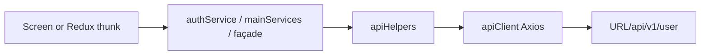

# WApp — API Layer Guide (`src/api/`)

Developer/agent map for the REST client, endpoints, and services. For app-wide architecture see [`ARCHITECTURE.md`](./ARCHITECTURE.md). Product flows: [`APP_FEATURES.md`](../APP_FEATURES.md).

Alias: `@api` → `src/api` (Babel `module-resolver`).

---

## File tree

```
src/api/
├── apiClient.js              # Axios instance, auth/session interceptors, getImageUrl
├── apiHelpers.js             # apiGet / apiPost / apiPut / apiDelete
├── endpoints.js              # Path constants: endpoints.auth | endpoints.main
├── googleSignIn.js           # Client ID constants (currently unused; IDs duplicated in service)
└── services/
    ├── authService.js        # Auth + CMS named exports
    ├── mainServices.js       # Product REST surface (largest)
    ├── onlineStatusService.js
    ├── crewGroupsService.js  # Mock/real façade for reusable groups
    ├── googleSignInService.js
    ├── appleSignInService.js
    ├── socialLoginService.js # Routes Google / Apple native SDKs
    └── index.js              # Barrel — broken for named-only modules; prefer direct imports
```

**Do not create:** `@api/services/cityTripService` — still imported (unused) by `cityTripSlice`; live APIs are in `mainServices`.

---

## Request flow



1. Prefer **named exports** from a service file.
2. Services call `apiGet` / `apiPost` / `apiDelete` with `endpoints.*` paths.
3. `apiClient` attaches Bearer token, unwraps `response.data`, handles 401/session.

Do not invent a second Axios/fetch wrapper for the user API. (Stripe **dev** backend in `src/services/payment/paymentApi.js` is the exception — production SetupIntent still uses `getClientSecret` via this layer.)

---

## Base URL & env

[`src/config/api.js`](../src/config/api.js):

| Export | Meaning |
|--------|---------|
| `URL` | Active host (`API_ENV=uat` → UAT, else production) |
| Defaults | `https://api.worldener.com` / `https://uat-api.worldener.com` |

`apiClient` baseURL: **`URL + "/api/v1/user"`**. Same `URL` is used for Socket.IO in Chat (not under `/api/v1/user`).

Changing `.env` / `API_ENV` requires a **Metro restart** (`babel-plugin-inline-dotenv`).

---

## `apiClient.js`

| Behavior | Detail |
|----------|--------|
| Timeout | 15s (override per call via helpers `config`, e.g. `getOrderDetails` uses 30s) |
| Auth | Redux `auth.user.accessToken`, else AsyncStorage `STORAGE_KEYS.TOKEN` → `Authorization: Bearer …` |
| JSON vs FormData | FormData → strip `Content-Type`; else `application/json` |
| Success | Returns **body** only (`response.data`) |
| 401 / `isSessionExpired` | Toast (unless skipped) → `handleSessionExpired()` |
| Logout URL | Session expiry skipped when URL includes `/logout` |

### Request config flags

| Flag | Effect |
|------|--------|
| `skipErrorToast` | No error toast (including session-expiry toast) |
| `skipSessionExpiry` | Do not call `handleSessionExpired` on 401 / flag |

Pass via helper third/config arg: `apiGet(url, params, { skipErrorToast: true })`.

### `getImageUrl(imagePath)`

- Empty → `undefined`
- Absolute `http(s)://` → unchanged
- Relative → `${URL}` + path (leading `/` added if needed)

Re-exported: `URL` from this module (also from `@config/api`).

---

## `apiHelpers.js`

| Helper | Signature | Notes |
|--------|-----------|--------|
| `apiGet` | `(url, params = {}, config = {})` | Query via `params` |
| `apiPost` | `(url, data = {}, config = {})` | Flags/timeout in `config` |
| `apiPut` | `(url, data = {}, config = {})` | Exported; **unused** by services today |
| `apiDelete` | `(url)` | **No config** — cannot pass `skipErrorToast` |

---

## Endpoints (`endpoints.js`)

Two groups: `endpoints.auth` and `endpoints.main`. Always add a leading `/` on new paths.

### Auth

| Constant | Path |
|----------|------|
| `login` | `/login` |
| `signup` | `/signup` |
| `otp` | `/verifyOtp` |
| `socialLogin` | `/socialLoginAndSignUp` |
| `guestLogin` | `/guestLogin` |
| `logout` | `/logout` |
| `getCategory` | `/getCategories` |
| `getProfile` | `/getProfile` |
| `selectCategory` | `/selectCategory` |
| `getCms` | `getCms` (missing leading `/` — historical) |

**Gap:** `authService.resendOtp` / `authSlice.requestOtp` reference `endpoints.auth.resendOtp`, which is **not defined**. Adding resend OTP requires adding that constant first.

### Main (by domain)

| Domain | Constants |
|--------|-----------|
| Presence | `updateOnlineStatus` |
| Cities / discovery | `getAllCity`, `getEventForYou`, `getPopularEvents`, `getEventBrowserByCategory`, `getCityCategories`, `getCategoriesTree`, `getCityActivities` |
| Trips | `getTrips`, `createTrip`, `updateTrip`, `deleteTrip`, `getTripDetails`, `getTripBuddies`, `getTripBycity`, `checkout`, `addEventInTrip` |
| Activities | `activityLikeUnlike`, `getEventDetails`, `getEventDates`, `getEventDatesDetails` |
| Cart / orders | `getCartList`, `cartCheckout`, `cartSchema`, `getParticipantSchema`, `cartCustomerInfo`, `createOrder`, `createStripePaymentIntent`, `createNoPayment`, `downloadVoucher`, `removeItemFromCart`, `updateParticipants`, `updateCart`, `getOrders`, `getOrderDetails`, `getRefundPolicies`, `cancelOrderItem`, `getTransactions` |
| Groups | `getGroups`, `getGroupList`, `shareActivityWithGroups`, `getGroupDetails`, `sendInvitation`, `getInvitations`, `acceptInvite`, `rejectInvite`, `getGroupMessages`, `reportUser`, `blockUser`, `getUserInfo`, `addUpdateEmoji`, `removeUserFromGroup`, `compareUsersInGroup`, `getGroupWishlisted` |
| Notifications | `getNotifications`, `markNotificationRead`, `getNotificationSettings`, `updateNotificationSettings` |
| Profile / Stripe / AI | `updateProfile`, `addCard`, `getClientSecret`, `getStripeCardList`, `chatbot`, `chatbotHistoryList`, `chatbotHistory` |

Path IDs are usually appended in the service: `` `${endpoints.main.getTripDetails}/${id}` ``.

---

## Services

### `authService.js`

Named exports: `signup`, `otp`, `resendOtp`, `login`, `guestLogin`, `logout`, `SocialLogin`, `getCategory`, `getProfile`, `SelectCategory`, `getCms`.

Consumed heavily by `authSlice`; screens also call `getCms` / `getProfile` directly.

### `mainServices.js`

Primary product REST module. Patterns:

- One-liner `apiGet`/`apiPost`/`apiDelete` + endpoint
- Append resource id in the URL string
- Query params via `apiGet(url, params)`
- `searchCityByName`: POST with `params`, empty body
- FormData: `updateProfile(formData)` — build with `@utils/formDataHelper`
- Duplicates: `getEventForYou` ≡ `getEventForYouCityId`; `addCard` ≡ `saveStripePaymentMethod`
- Flags: `getRefundPolicies({ skipErrorToast: true })`; longer timeout on `getOrderDetails`

Many screens import `mainServices` **directly** (not only via Redux). That is intentional for one-off UI actions.

### `onlineStatusService.js`

`updateOnlineStatus(data)` → `POST` `update-online-status`. Used by `onlineStatusSlice` and notification settings.

### `crewGroupsService.js`

Facade over mocks vs `mainServices` for reusable groups. Toggle: `REUSABLE_GROUPS_MOCK_ENABLED` in `@config/reusableGroupsMock` (currently `true`).

| Concern | Rule |
|---------|------|
| Screens / slices | Call `crewGroupsService` only |
| Mocks | Stay under `src/mocks/` — do not import from UI |
| Unimplemented when mock off | e.g. opt-in/out, create crew return “API not implemented” stubs |

See [`REUSABLE_GROUPS_APP_IMPLEMENTATION.md`](./REUSABLE_GROUPS_APP_IMPLEMENTATION.md).

### Social (native SDK, not REST)

```
SocialLoginButtons
  → socialLoginService.signIn("google"|"apple")
  → googleSignInService / appleSignInService
  → buildSocialLoginPayload (@utils/socialLoginPayload)
  → authSlice.googleAppleSignIn → authService.SocialLogin → POST /socialLoginAndSignUp
```

`googleSignIn.js` config is unused; client IDs are hardcoded in `googleSignInService`. Prefer consolidating into one config file if you touch social auth.

### `services/index.js`

Re-exports `default as authService` etc. `authService` / `mainServices` have **no default export**. Prefer:

```js
import { login } from "@api/services/authService";
import { getTrip } from "@api/services/mainServices";
```

---

## Redux ↔ API map

| Slice | Services |
|-------|----------|
| `authSlice` | `authService`; `mainServices.getCategoriesTree` |
| `cityTripSlice` | `mainServices` (ignore dead `cityTripService` import) |
| `chatSlice` | `mainServices.getGroupMessages` |
| `onlineStatusSlice` | `onlineStatusService` |
| `paymentSlice` | `mainServices.getStripeCardList` + `src/services/payment/*` (which uses `getClientSecret`) |

Cart, booking, chatbot, and most group UI often call services from screens.

---

## Change checklists

### New REST endpoint

1. Add constant under `endpoints.auth` or `endpoints.main` (leading `/`).
2. Add named export in `authService.js`, `mainServices.js`, or a dedicated service.
3. Use `apiGet` / `apiPost` / `apiDelete` only.
4. Wire `createAsyncThunk` in a slice **or** call from the screen.
5. Use `handleAsyncCases` when matching existing slice style.
6. Pass `{ skipErrorToast: true }` only when the UI handles errors.

### Multipart upload

1. Build `FormData` with `@utils/formDataHelper`.
2. `apiPost` the FormData — client strips `Content-Type`.

### Reusable groups

1. Extend `crewGroupsService` façade.
2. Do not import `@mocks` from screens/slices.
3. Flip `REUSABLE_GROUPS_MOCK_ENABLED` when backend is ready.

### Social auth change

1. Prefer SDK services + `socialLoginPayload` + `SocialLogin` POST.
2. Avoid duplicating client IDs in a third place.

---

## Known footguns

| Issue | Detail |
|-------|--------|
| Missing `cityTripService` | Dead import in `cityTripSlice` — use `mainServices` |
| Missing `resendOtp` endpoint | Service/slice reference undefined path |
| Broken barrel `services/index.js` | No default exports on REST modules |
| Unused `googleSignIn.js` | IDs duplicated in `googleSignInService` |
| `apiDelete` no config | Cannot skip toasts on DELETE |
| `getCms` path | No leading `/` |
| Always-on `console.log` | Request/response logging in `apiClient` |

---

## Related files

| Path | Role |
|------|------|
| `src/config/api.js` | `URL` / `API_ENV` |
| `src/utils/sessionHandler.js` | 401 → clear storage + `expireSession` |
| `src/utils/storageKeys.js` | `TOKEN`, `USER_DATA` |
| `src/utils/formDataHelper.js` | Multipart builders |
| `src/utils/socialLoginPayload.js` | Social → backend body |
| `src/config/reusableGroupsMock.js` | Crew mock flag |
| `src/services/payment/` | Stripe façade (uses `getClientSecret`) |
| `.cursor/rules/api-layer.mdc` | Agent rules for this folder |
| `.cursor/rules/api-redux.mdc` | API + Redux wiring |
